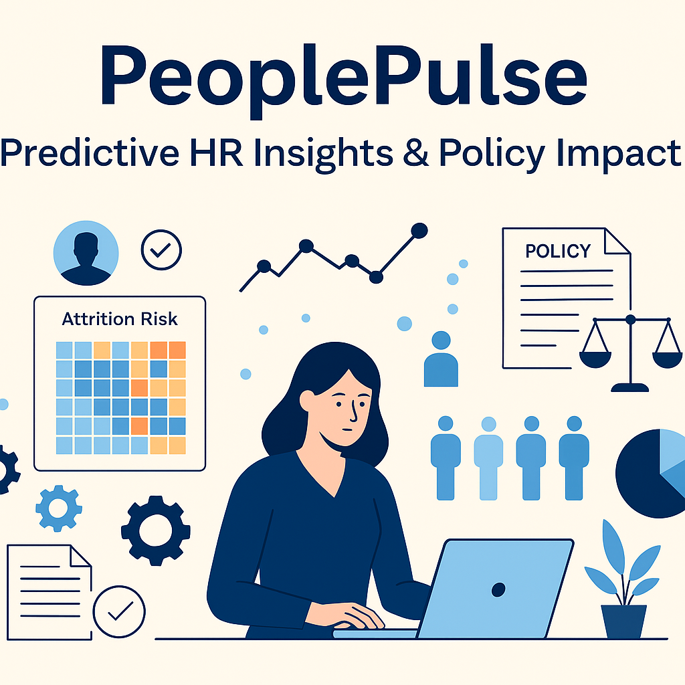

# Strategic HR Analytics for Workforce Planning & Policy Development



## 🚀 Project Overview

**Strategic HR Analytics for Workforce Planning & Policy Development** is a hands-on portfolio project tailored for government HR analysts. It demonstrates how to:

- **Predict Attrition Risk** across departments and tenures using explainable AI
- **Measure Pay Equity** and diversity trends with statistical and visual analysis
- **Assess Policy Impact** before-and-after major HR policy changes
- **Simulate Real-Time HRIS Events** via Kafka streaming
- **Govern Data** with automated validation pipelines and compliance benchmarks

This project bridges technical expertise—Python, SQL, Power BI, Kafka—with strategic HR metrics, making it a perfect showcase for roles like Loudoun County Government’s HR Data Analyst.

---

## ✨ Key Features

| Feature                         | Description                                                    |
|---------------------------------|----------------------------------------------------------------|
| **Attrition Prediction**        | Random Forest model with SHAP explainability for risk scoring  |
| **Pay Equity Analysis**         | Gender & race salary band comparison with fairness scoring     |
| **Policy Impact Assessment**    | Before/after analytics on salary, retention, and compliance    |
| **Real-Time Event Simulation**  | Kafka Python scripts to mimic live HR events                   |
| **Data Governance Pipelines**   | Automated ETL, validation, and quality checks for HR data      |
| **Interactive Dashboards**      | Power BI reports with infographics and drill-down visuals      |

---

## 📁 Repository Structure

```bash
HR-Analytics-Workforce-Planning/
├── data/                          # Sample CSV datasets
│   ├── employee_master.csv        # Employee demographic & role data
│   ├── performance_reviews.csv    # Review scores & training metrics
│   ├── attrition.csv              # Exit records and reasons
│   ├── policies.csv               # Policy change logs
│   └── compliance_events.csv      # Audit findings & resolutions
├── notebooks/                     # Jupyter notebooks for analysis
│   ├── 01_data_cleaning_EDA.ipynb  # Data preparation & exploratory insights
│   ├── 02_attrition_prediction.ipynb # Model training & evaluation
│   ├── 03_pay_equity_analysis.ipynb  # Statistical equity reports
│   └── 04_policy_impact_analysis.ipynb # Policy benchmarking
├── scripts/                       # Automation & streaming code
│   ├── data_processing.py         # ETL & preprocessing utility
│   └── stream_to_db_kafka.py      # Kafka event simulation
├── dashboards/                    # Power BI `.pbix` files (import manually)
│   ├── HR_Attrition_Dashboard.pbix
│   └── Pay_Equity_Dashboard.pbix
├── assets/                        # Images for README and documentation
│   └── banner.png
├── README.md                      # This file
└── requirements.txt               # Python dependencies
```

---

## 🔧 Installation & Setup

1. **Clone the repository**
   ```bash
   git clone https://github.com/yourusername/HR-Analytics-Workforce-Planning.git
   cd HR-Analytics-Workforce-Planning
   ```

2. **Install Python dependencies**
   ```bash
   pip install -r requirements.txt
   ```

3. **Launch Jupyter**
   ```bash
   jupyter notebook
   ```

4. **Open notebooks** in the `notebooks/` folder and run cells from top to bottom.

5. **Import dashboards**
   - Open Power BI Desktop
   - Load the cleaned CSVs from `data/cleaned_hr_data.csv`
   - Open `.pbix` files in `dashboards/`

---

## 📊 Usage

1. **EDA & Data Cleaning**: Run `01_data_cleaning_EDA.ipynb` to inspect and clean datasets.
2. **Predictive Modeling**: Execute `02_attrition_prediction.ipynb` to train the attrition model and interpret SHAP plots.
3. **Equity Reports**: Use `03_pay_equity_analysis.ipynb` to generate pay equity scores and visual summaries.
4. **Policy Benchmarks**: Run `04_policy_impact_analysis.ipynb` to analyze policy change effects.
5. **Real-Time Demo**: Execute `scripts/stream_to_db_kafka.py` to simulate HR events and refresh dashboards.

---

## 🛠️ Technology Stack

- **Python & Pandas** for data manipulation
- **Scikit-Learn & SHAP** for predictive modeling and explainability
- **SQL** for data governance queries and benchmarks
- **Power BI** for interactive dashboards and infographics
- **Kafka (kafka-python)** for streaming simulation

---

## 🎯 Aligning with Government HR

- **Compliance Focus**: Audit and resolution tracking mirrors government HR audit cycles
- **Policy Simulation**: Model impact of legislative changes (e.g., pay grade adjustments, hybrid-work mandates)
- **Equity & Inclusion**: Dashboard equity scores tie to DEI objectives mandated by public-sector guidelines
- **Scalability**: Kafka-based streaming demonstrates readiness for enterprise HRIS environments

---

## 📛 License & Contributing

This project is released under the MIT License. Contributions and improvements are welcome—feel free to open issues or PRs.

---

## 📬 Contact & Next Steps

- **Author**: Ravi Datta Rachuri
- **Email**: jobs.ravidatta@gmail.com
- **LinkedIn**: https://linkedin.com/in/ravi-datta-rachuri

**Ready to deploy?** Push this repo to GitHub, attach it to your resume, and you’ll have a standout HR analytics showcase that speaks directly to Loudoun County’s needs.

---

> “Data-driven HR isn’t just about metrics—it’s about powering people-centric policies for real-world impact.”
